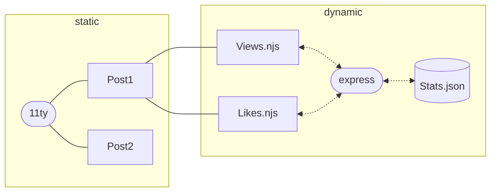
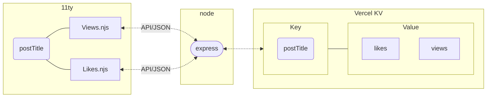

I like 11ty for its simplicity. Once you understand that its documentation is shit[^4] and you are left alone in this developer life to struggle in the ultimate quest to achieve enlightenment, you might even say that it's a good blogging framework that can teach you important lessons about [craving](https://en.wikipedia.org/wiki/Ta%E1%B9%87h%C4%81) and [duḥkha](https://en.wikipedia.org/wiki/Du%E1%B8%A5kha).

A few months ago, I was eager to add some small features to my blog: a view count and a like button that viewers can click to give me some temporary pleasure before I slide back into fullness of emptiness.

So I started my quest with simple idea: add [express](https://expressjs.com/) as the backend, create some APIs, write data to a JSON file, and voila!<sup>🎯</sup>



The issue with this approach is that I don't have my own server, just a free Vercel hobby account. Vercel [doesn't allow writing to a file](https://vercel.com/guides/how-can-i-use-files-in-serverless-functions) and directs you towards a more [serverless approach](https://vercel.com/docs/functions), encouraging you to learn new things instead of staying comfortable with your 10-year-old mindset.

## Cooking the solution

Mixing 11ty with Express and Vercel serverless functions is like mixing cough syrup with iodine and lye[^0]. It takes time, but you might end up with something nice. Or, you could get frustrated and burn your house down. It took me about two working days to get it sorted properly, but the house is okay.

The issue lay in the Vercel itself - by default the framework is predicted from `build` script from the `package.json` file. In our case is clearly 11ty.

```json
{
  "name": "dynamic-11th",
  "version": "1.0.0",
  "scripts": {
    "build": "eleventy",
    "watch": "eleventy --watch",
    "start": "node server.js" // this won't be executed in serverless context
  },
  "dependencies": {
		"@11ty/eleventy": "^2.0.1",
		"express": "^4.17.1",
		"@vercel/kv": "0.2.1"
	}
}
```

But we can override that by setting different options in the [Project Build Settings](https://vercel.com/docs/deployments/configure-a-build). The only issue is that we cannot set there two separate build settings (static 11ty build and node execution). However, we can utilize the `vercel.json` file to achieve this

```json
{
  "version": 2,
  "builds": [
    {
      // build static sites using npm build and set output directory to /_site
      "src": "package.json",
      "use": "@vercel/static-build",
      "config": {
        "distDir": "_site"
      }
    },
    {
      // start the node server as a serverless function
      "src": "server.js",
      "use": "@vercel/node"
    }
  ],
  "routes": [
    // handle all API requests to express
    { "src": "/api/.*", "dest": "/server.js" },
    // handle everything else to index.html
    { "src": "/(.*)", "dest": "/_site/$1" }
  ]
}
```

So all we have to do now is create and populate `server.js` in our root folder with some [basic API endpoints](https://vercel.com/guides/using-express-with-vercel) and a place to store the data. Fortunately, Vercel provides serverless Redis storage: [Vercel KV](https://vercel.com/docs/storage/vercel-kv)[^1], which we can [easily utilize](https://vercel.com/docs/storage/vercel-kv/quickstart) for that purpose.

Let's update the chart with more data so we know where we are right now



So now we just need to access the database and get or set the key. Let's assume that we already have `postTitle`, so our pseudocode can be simplified. To increase the value we use [HINCRBY](https://redis.io/docs/latest/commands/hincrby/); to retrieve it, we use [HGET](https://redis.io/docs/latest/commands/hget/). If the value does not exist, we use [HSET](https://redis.io/docs/latest/commands/hset/).
```js
const { kv } = require("@vercel/kv");
// Increase view
// If key does not exist, a new key holding a hash is created
// If value does not exist the value is set to 0 before the operation is performed
const views = await kv.hincrby(postTitle, "views", 1);

// Get likes. If the value does not exist set it to zero and return that value
const likes =
  (await kv.hget(postTitle, "likes")) || (await kv.hset(postTitle, "likes", 0));
```

> Note that even though the official Redis documentation states that these functions can be written in uppercase, the code within `server.js` is case-sensitive!
>
> Also, observe the brackets around `@vercel/kv` import. I wasted 3 hours looking for the reason why KV is not working properly.

Now the `server.js` can be populated with proper APIs that will handle get/post requests.

```js
const express = require("express");
const { kv } = require("@vercel/kv");

const app = express();
const PORT = process.env.PORT || 8080;

// Middleware to parse JSON bodies
app.use(express.json());

// Basic health check
app.get("/api/", (req, res) => res.json({ message: "Hello from Express!" }));

// Get the likes count
app.get("/api/:postTitle/likes", async (req, res) => {
    try {
        const { postTitle } = req.params;
        const likes = (await kv.hget(postTitle, "likes")) || 0;

        res.json({ likes: likes });
    } catch (err) {
        console.error(err);
        res.status(500).send("Error getting likes count!");
    }
});

// Update the likes count
app.post("/api/:postTitle/likes", async (req, res) => {
    try {
        const { postTitle } = req.params;
        const likes = await kv.hincrby(postTitle, "likes", 1);

        res.json({ likes: likes });
    } catch (err) {
        console.error(err);
        res.status(500).send("Error updating likes count!");
    }
});

// Get the views and increment them. Every request is a new view
app.get("/api/:postTitle/views", async (req, res) => {
    try {
        const { postTitle } = req.params;
        const views = await kv.hincrby(postTitle, "views", 1);

        res.json({ views: views });
    } catch (err) {
        console.error(err);
        res.status(500).send("Error getting post views!");
    }
});

app.listen(PORT, () => console.log(`Server ready on port ${PORT}.`));

module.exports = app;
```

Now the best part. Putting it all together in the [half-ass manner](https://everythingchanges.us/blog/half-ass-it/)[^2].

In the first line of `Views.njk` the `data-postTitle` should contain **&lbrace;&lbrace; title &rbrace;&rbrace;** value, but unfortunately 11ty tries to render the post title there, so I had to improvise for clarity. In your solution, simply replace it with curly brackets.

```html/0
<p id="views" class="views" data-postTitle="<< title >>"></p>

<script>
  const viewsP = document.getElementById("views");
  const postTitle = viewsP.dataset.postTitle;

  document.addEventListener("DOMContentLoaded", async () => {
    const response = await fetch(`/api/${postTitle}/views`,{ method: "GET" });
    const data = await response.json();

    viewsP.textContent = data.views;
  });
</script>
```

and `LikeButton.njk` with the same issue like before:

```html/0
<button id="likeButton" class="likes" data-button-id="<< title >>">
  <span id="likesCount"></span>
</button>

<script>
  const likeButton = document.getElementById("likeButton");
  const likesCount = document.getElementById("likesCount");
  const postTitle = likeButton.dataset.buttonId;

  document.addEventListener("DOMContentLoaded", async () => {
    const response = await fetch(`/api/${postTitle}/likes`, { method: "GET" });
    const data = await response.json();
    likesCount.textContent = data.likes;

    const handleClick = async () => {
      const response = await fetch(`/api/${postTitle}/likes`, { method: "POST" });
      const data = await response.json();
      likesCount.textContent = data.likes;

      // Remove the event listener after the first click
      likeButton.removeEventListener("click", handleClick);
    };

    likeButton.addEventListener("click", handleClick);
  });
</script>
```

This code can be accessed like so **&lbrace;% include "likeButton.njk" %&rbrace;** on every page. You can check [working demo](https://dynamic-11th.vercel.app) and the code on [GitHub](https://github.com/Megaemce/dynamic-11th). Now smash that like button below!



[^0]: ...then mixing it with strike pads off a matchbook, muriatric acid and hydrogen peroxide, and then, maybe somehow... [crystal meth](https://www.youtube.com/watch?v=gnPnEvy4e70) 🙅
[^1]: KV stands for `key` and `value` so you can interact with this pseudo-database like a normal object, with limitations due to its [very daft syntax](https://redis.io/docs/latest/develop/connect/cli/). This was further restricted by Vercel itself to [only few keywords](https://varnandh.com/blog/beginner-guide-to-vercel-kv#examples-of-supported-redis-commands). For those who dislike this solution, there is also [Vercel Postgres](https://github.com/vercel/examples/blob/main/solutions/express/api/index.ts)
[^2]: I'm sure there are better ways to handle this in njk files without resorting to ugly `<script>` tags, but I've had enough of that for now.
[^4]: I love creating and fixing documentation myself, and I'm really proud to call myself a documentation hero. However, 11ty's documentation is beyond anyone's ability to improve; it's simply bad. The only way I can see it being improved is by starting from scratch, and I just wanted to create a quick blog, not save the world. For anyone else considering 11ty, I suggest Next.js. Implementing features like a view counter or a like button is a breeze there, and you can even find ready-made projects with these features included.